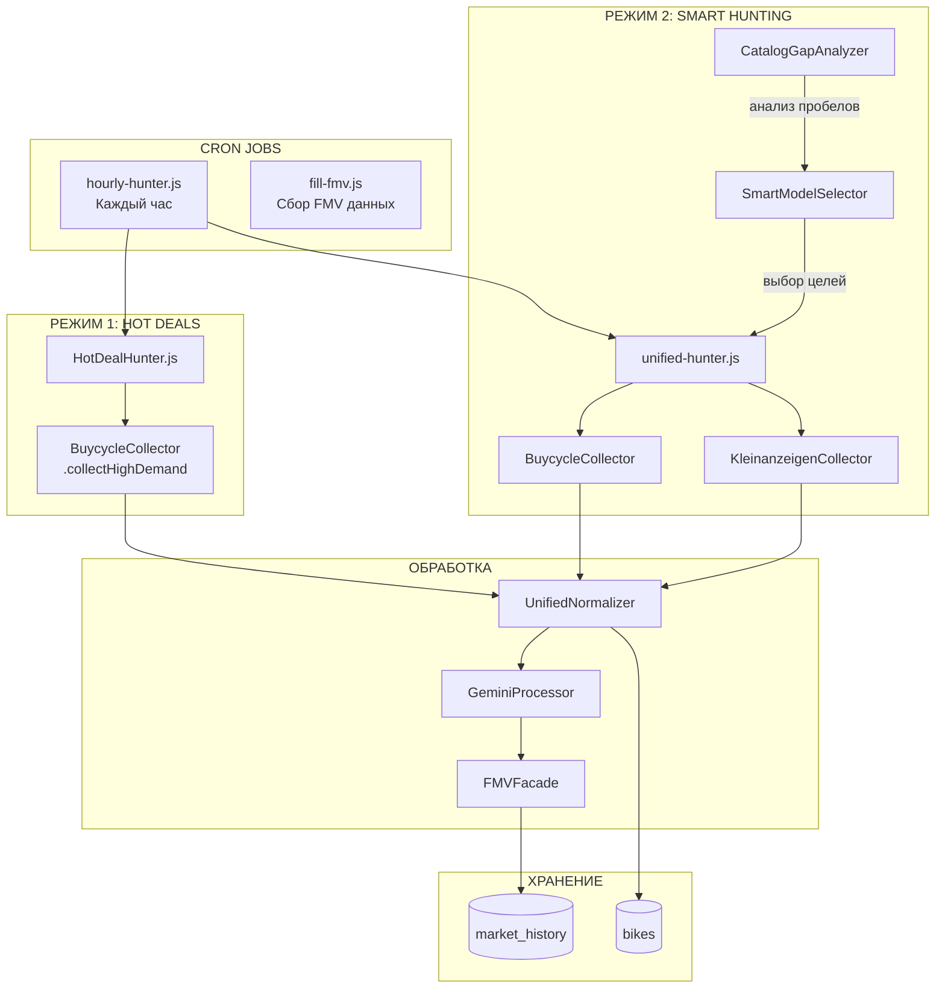

# 🚴 Hunter System — Техническая Документация

**Версия:** 2.0.0  
**Дата:** 04.02.2026

---

## 📊 Обзор Архитектуры



---

## 🔧 Ключевые Компоненты

### 1. Парсеры

| Файл | Назначение | Ключевые методы |
|------|------------|-----------------|
| [buycycle-parser.js](file:///c:/Users/hacke/CascadeProjects/Finals1/eubike/backend/parsers/buycycle-parser.js) | Парсинг страниц Buycycle | `parse()`, `extractBrand()`, `extractPhotos()` |
| [kleinanzeigen-parser.js](file:///c:/Users/hacke/CascadeProjects/Finals1/eubike/backend/parsers/kleinanzeigen-parser.js) | Парсинг Kleinanzeigen + **анти-мопед фильтр** | `parse()`, `isBicycleCategory()`, `deriveFrameSize()` |

### 2. Скраперы/Коллекторы

| Файл | Назначение | Ключевые методы |
|------|------------|-----------------|
| [buycycle-collector.js](file:///c:/Users/hacke/CascadeProjects/Finals1/eubike/backend/scrapers/buycycle-collector.js) | Puppeteer-скрапер Buycycle | `collectHighDemand()`, `collectForTarget()`, `logBatchToFMV()` |
| [kleinanzeigen-collector.js](file:///c:/Users/hacke/CascadeProjects/Finals1/eubike/backend/src/scrapers/kleinanzeigen-collector.js) | Puppeteer-скрапер Kleinanzeigen | `searchBikes()`, `scrapeListing()` |

### 3. Сервисы

| Файл | Назначение | Ключевые методы |
|------|------------|-----------------|
| [UnifiedNormalizer.js](file:///c:/Users/hacke/CascadeProjects/Finals1/eubike/backend/src/services/UnifiedNormalizer.js) | Стандартизация данных + Gemini + FMV | `normalize()`, `postProcess()`, `applyQualityScore()` |
| [FMVFacade.js](file:///c:/Users/hacke/CascadeProjects/Finals1/eubike/backend/src/services/FMVFacade.js) | **Единая точка входа FMV** | `calculate()`, `compare()`, `evaluateDeal()` |
| [FMVAnalyzer.js](file:///c:/Users/hacke/CascadeProjects/Finals1/eubike/backend/src/services/FMVAnalyzer.js) | Расчёт FMV из market_history | `getFairMarketValue()`, `removeOutliers()` |
| [SmartModelSelector.js](file:///c:/Users/hacke/CascadeProjects/Finals1/eubike/backend/src/services/SmartModelSelector.js) | Выбор моделей для охоты | `selectModelsForHunting()`, `buildFiltersFromGaps()` |

### 4. Cron Jobs

| Файл | Расписание | Назначение |
|------|------------|------------|
| [hourly-hunter.js](file:///c:/Users/hacke/CascadeProjects/Finals1/eubike/backend/cron/hourly-hunter.js) | Каждый час | Hot Deals + Smart Hunting |
| [fill-fmv.js](file:///c:/Users/hacke/CascadeProjects/Finals1/eubike/backend/cron/fill-fmv.js) | По запросу | Сбор данных для FMV |

---

## 📈 Потоки Данных

### Flow 1: Hot Deals Collection

```
hourly-hunter.js
    ↓
HotDealHunter.hunt(5)
    ↓
BuycycleCollector.collectHighDemand()
    ↓ (извлекает ~20 листингов)
    ↓ (фильтрует по ALLOWED_BRANDS)
    ↓
logBatchToFMV() → market_history
    ↓
scrapeListingDetails() → детали каждого байка
    ↓
UnifiedNormalizer.normalize()
    ↓   ↓
    ↓   GeminiProcessor.analyzeBikeToUnifiedFormat()
    ↓   ↓
    ↓   FMVAnalyzer.getFairMarketValue()
    ↓
DatabaseService.saveBikesToDB() → bikes
```

### Flow 2: Smart Hunting (Gap-Based)

```
unified-hunter.js
    ↓
SmartModelSelector.selectModelsForHunting()
    ↓ (анализирует дефициты: размеры, цены, модели)
    ↓
BuycycleCollector.collectForTarget() / KleinanzeigenCollector.searchBikes()
    ↓
logBatchToFMV() → market_history
    ↓
UnifiedNormalizer.normalize()
    ↓
DatabaseService.saveBikesToDB() → bikes
```

### Flow 3: FMV Calculation

```
UnifiedNormalizer.normalize()
    ↓
FMVFacade.calculate(brand, model, year)
    ↓
FMVAnalyzer.getFairMarketValue()
    ↓
market_history SELECT (last 90 days, >= 3 samples)
    ↓
removeOutliers() (IQR method)
    ↓
calculateMedian() + calculateConfidence()
    ↓
{ fmv, confidence, sample_size, price_range }
```

---

## 🗃️ Схема Базы Данных

### Таблица `bikes`

| Колонка | Тип | Описание |
|---------|-----|----------|
| id | INTEGER | Primary key |
| name | TEXT | Полное название |
| brand | TEXT | Бренд |
| model | TEXT | Модель |
| year | INTEGER | Год выпуска |
| price | REAL | Цена в EUR |
| fmv | REAL | Fair Market Value |
| quality_score | INTEGER | 0-100, качество листинга |
| frame_size | TEXT | XS/S/M/L/XL |
| is_active | INTEGER | 0/1 |
| is_hot_offer | INTEGER | 0/1 |
| source_platform | TEXT | buycycle/kleinanzeigen |
| source_url | TEXT | Ссылка на источник |

### Таблица `market_history`

| Колонка | Тип | Описание |
|---------|-----|----------|
| id | INTEGER | Primary key |
| brand | TEXT | Бренд |
| model | TEXT | Модель |
| year | INTEGER | Год выпуска |
| price_eur | REAL | Цена в EUR |
| source | TEXT | buycycle/kleinanzeigen/bikeflip |
| source_url | TEXT | **UNIQUE** |
| frame_size | TEXT | Размер рамы |
| scraped_at | DATETIME | Дата скрапинга |

---

## ⚙️ Конфигурация

### brands-config.json

```json
{
  "tier1": [
    {"name": "YT", "models": ["capra", "jeffsy", "tues"], "minPrice": 1500},
    {"name": "Santa Cruz", "models": ["bronson", "nomad"], "minPrice": 1500}
  ],
  "tier2": [...],
  "tier3": [...]
}
```

### Параметры hourly-hunter

```javascript
config = {
    targetCatalogSize: 500,  // Целевой размер каталога
    minCatalogSize: 100,     // Минимум перед срочным пополнением
    normalBatch: 20,         // Обычное пополнение
    urgentBatch: 20,         // Срочное пополнение
    maxBikesPerHour: 20      // Защита от перегрузки
}
```

---

## 🧪 Тестирование

### Тестовые скрипты

```bash
# Тест парсера Buycycle
node backend/tests/test-buycycle-parser-live.js

# Тест парсера Kleinanzeigen (с мопед-фильтром)
node backend/tests/test-kleinanzeigen-parser-live.js
```

### Результаты тестов

| Парсер | Checks | Result |
|--------|--------|--------|
| Buycycle | 6/7 | ✅ 86% |
| Kleinanzeigen | 7/7 | ✅ 100% |

---

## 🔒 Защитные Механизмы

### 1. Анти-мопед фильтр (Kleinanzeigen)

```javascript
// kleinanzeigen-parser.js
static isBicycleCategory(categoryInfo) {
    const BICYCLE_CATEGORIES = ['217', '210', '211', '212', '213', '214', '215', '216'];
    const FORBIDDEN_KEYWORDS = ['motorrad', 'moped', 'roller', 'simson', 'vespa'];
    // ...
}
```

### 2. Anti-Bot Detection

- Puppeteer-extra с StealthPlugin
- Random User-Agent
- Delays между запросами (2-3 секунды)

### 3. Duplicate Protection

- `source_url UNIQUE` в market_history
- `applyDuplicateCheck()` в UnifiedNormalizer

### 4. Quality Score

- Минимум 40 для сохранения в каталог
- Учитывает: бренд, модель, год, фото, описание

---

## 🚀 Запуск

### Ручной запуск Hunter

```bash
# Smart Hunt для конкретной модели
node backend/scripts/unified-hunter.js YT Capra

# Full режим (все модели)
node backend/scripts/unified-hunter.js --mode=full

# Test режим (1 модель, 5 результатов)
node backend/scripts/unified-hunter.js --mode=test
```

### Cron Setup

```bash
# Каждый час
0 * * * * cd /path/to/eubike/backend && node cron/hourly-hunter.js
```

---

## 📋 Чеклист для Отладки

| Проблема | Проверить |
|----------|-----------|
| Мопеды в каталоге | `isBicycleCategory()` в kleinanzeigen-parser.js |
| FMV = null | `market_history` — нужно минимум 3 записи |
| Неправильный frame_size | `deriveFrameSize()` — приоритеты: title → URL → attributes → description |
| Duplicates | `source_url UNIQUE` constraint |
| Slow scraping | Anti-bot detection — увеличить delays |

---

## 📊 Мониторинг

### Логи

```bash
# Hourly Hunter логи
cat backend/logs/hourly-hunter.log

# FMV Collection логи
cat backend/logs/balanced_fmv.log
```

### Статистика

```javascript
const FMV = require('./src/services/FMVFacade');
const stats = await FMV.getStats();
// { totalRecords: 1234, recentRecords: 56, avgPrice: 2100 }
```
